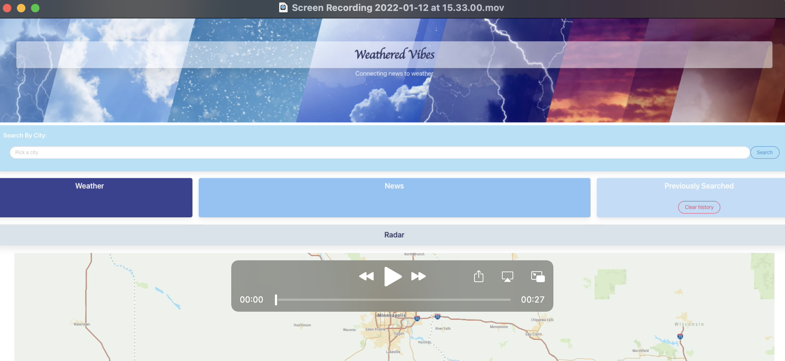

# WeatheredVibes

## Description

As a user I want to look up a city to get the current weather and suggested current news articles based on the location searched, so that I can stay up to daye with my surroundings.

## Usage

Weathered Vibes is an application that lets a user look up a city and get the current weather and suggested news articles based on the location searched, so that they can stay up to date with their surroundings. At the top of the application is a search bar for the user to type in a city. Below the search bar are three containers. The first container is the current weather of the city searched. This container includes the city, date and time, current temp, current weather conditions, current wind speed, and current humidty. The second container is a suggested news article based on the location search. There is a desciription of the news article and a link to the whole article on a third party site. The third container lists all the previous cities searched as well as a clear history button. This container allows you to click on a previous searched city and get the current weather as well as clearing all the previously searched cities. At the bottom of the page is an interactive radar map that pulls up the location that was searched.

## Used Libraries

1. [Open Weather Map API](https://openweathermap.org/api/one-call-api)
2. [TOMTOM API](https://developer.tomtom.com/map-display-api/documentation/product-information/introduction)
3. [GNews API](https://gnews.io/docs/v4#introduction)
4. [JavaScript](https://www.javascript.com/)
5. [HTML](https://html.com/)
6. [CSS](https://developer.mozilla.org/en-US/docs/Web/CSS)
7. [jQuery](https://jquery.com/)
8. [Bulma](https://bulma.io/)

## Homepage

## Demo

## Webiste

- Deployed Project can be found here(https://)
- Repository can be found [here](https://github.com/SepidehAyani/WeatheredVibes)

## Contributers

- [Kevin](https://github.com/Kawilder)
- [Logan](https://github.com/ldonald6)
- [Megan](https://github.com/Metelak)
- [Heidi](https://github.com/hmailahn)
- [Sepideh](https://github.com/SepidehAyani)
